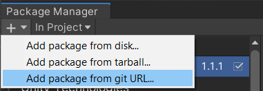
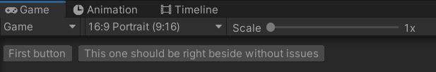

# Unity Helper Package

This package was created in order to help the development of simple projects by providing easy, ready to use systems.

## Table of contents

- [Installation](#installation)
- [Singleton](#singleton)
- [Event System](#event-system)
- [Game View Buttons](#game-view-buttons)

## Installation

This package follows the [Package layout recommendation by Unity](https://docs.unity3d.com/Manual/cus-layout.html).

To install, simply open the *Package Manager*, and add the package from the git URL <https://github.com/JonathanRN/UnityHelperPackage.git>



> Unity version 2019.4 or later is recommended.

### Updating

A limitation from Unity prevents git packages to update automatically or when refreshing the Package Manager. However it is still possible to update the package by re-adding the package using the git URL.

> Deleting the package beforehand is **not** necessary.

---

## Singleton

A simple `singleton.cs` file is available to the Singleton pattern into applications.

This implementation uses [lazy initialization](https://docs.microsoft.com/en-us/dotnet/api/system.lazy-1?view=net-5.0) which allows the Singleton to be created only once when the static `Instance` is called.

### Usage

```csharp
public class Example : Singleton<Example>
{
    public void ExampleMethod()
    {
        // Code...
    }
}

// Somewhere else in the code
{
    Example.Instance.ExampleMethod();
}
```

---

## Event System

A unique event system was created for easier management of communication between Unity components.

### Usage

To register (subscribe) to an event, first inherit from the `EventListener` class :

```csharp
public class Example : EventListener
{
    // Code...
}
```

Then subscribe to an event using the `SubscribeTo` method. Specify the name of the event (string) and the callback when said event is called (Action\<object\>).

```csharp
public class Example : EventListener
{
    private void Start()
    {
        SubscribeTo("yourEventName", (obj) =>
        {
            // Do something with the event and the argument...
        });

        // It is also possible to unsubscribe from events.
        UnsubscribeFrom("yourEventName");
    }
}
```

To call (emit) an event, simply call `Emit` with the event name, and an optional parameter.

```csharp
{
    // Since the 2nd parameter is an object, it can take any type or objects
    Emit("yourEventName"); // 2nd parameter is null by default
    Emit("yourEventName", 42);
    Emit("yourEventName", false);

    // It is also possible to emit events directly from the EventManager
    EventManager.Instance.EmitEvent("yourEventName", ...);

    // Code...
}
```

In cases when a component subscribe later to an event, it is possible to get the latest event for a specified event name upon subscribing to it. To do so, set the following flag :

```csharp
{
    SyncLastEvent = true;
    // Code...
}
```

---

## Game View Buttons

The single file `GameViewButton` allows to add buttons to the Unity Game View with a simple call. The buttons are created upon start of the application and removed on exit. They are located by default on the top-left of the window.



### Usage

```csharp
// It is recommended to call from Awake, Start, or whenever initialization happens.
private void Start()
{
    GameViewButton.Show("Button title goes here", OnClickAction);
}
```
